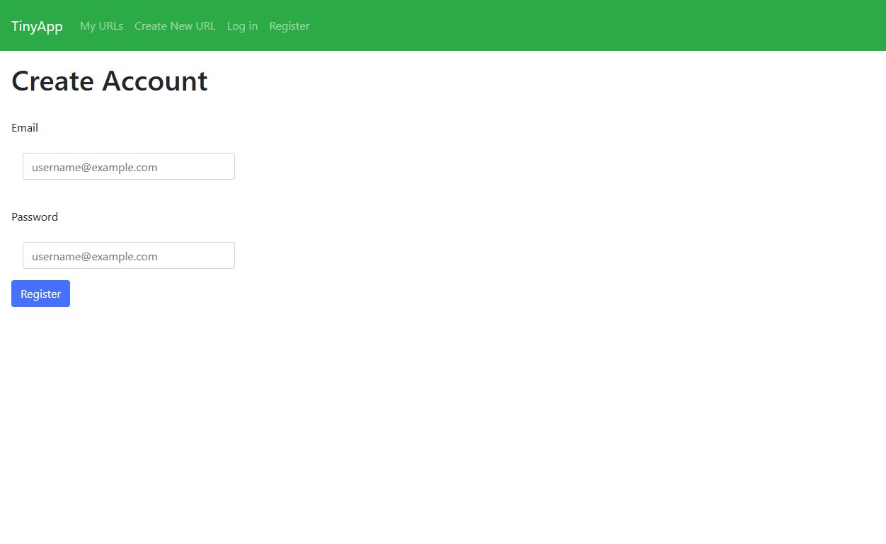
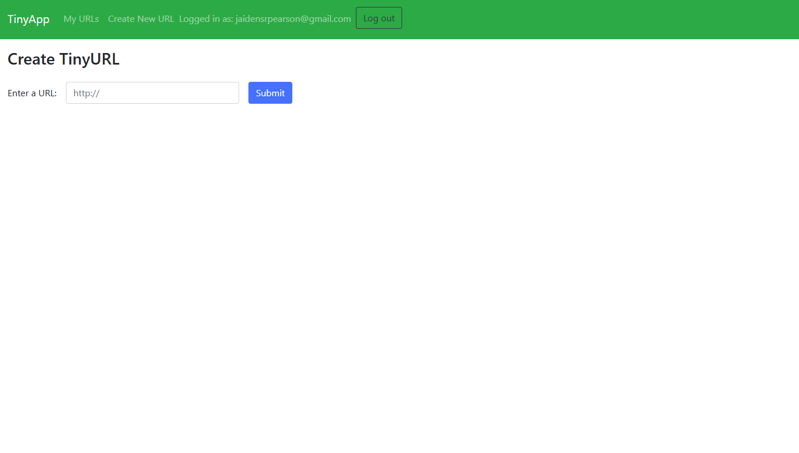
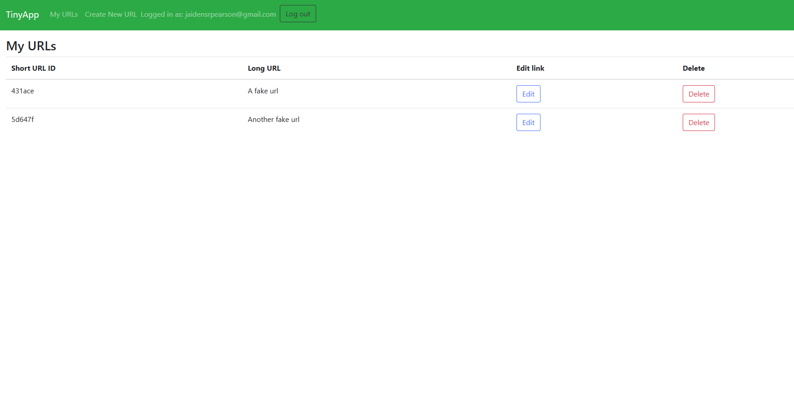

# TinyAPP

TinyApp is  URL shortening app that takes in a url from any site and shortens it to a 6 character short url for posting on apps with limited charater limits.

## How to run app

1. Clone repo and download all dependencies for the application.

2. Open the repo in your IDE and go to the TinyApp directory. 

3. Use the following npm command in the terminal to run the server: ```npm run start```

4. Open your browswer to ```http://localhost:8080/register``` to register a user and enter the app.

  


### From here you can add a new url form the 'Create New Url' in the header on each page.



### Urls are stored in the My URLs page where the can be edited or deleted.



Application written by: 

Application logic and UI: [Jaiden Pearson](https://github.com/Jaidenpearson)

UI templates: [Lighthouse Labs](https://github.com/lighthouse-labs)


